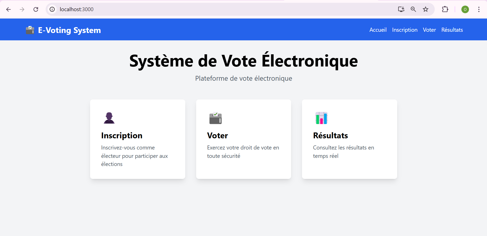
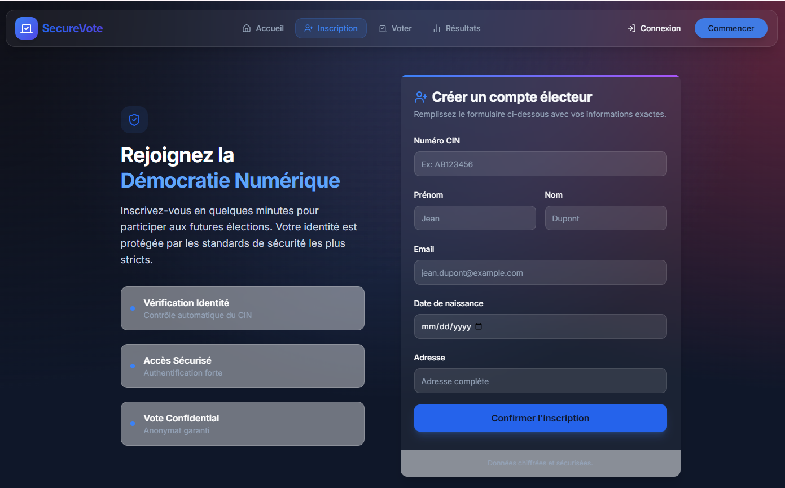
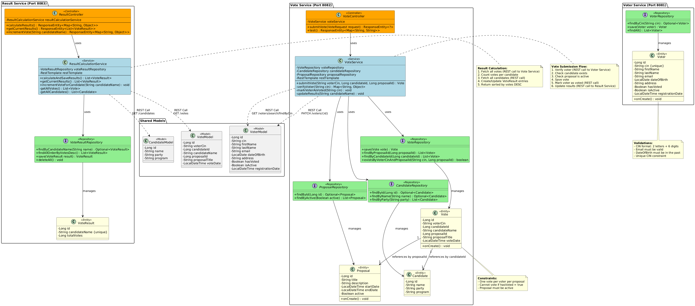

# 🗳️ Système de Vote Électronique (E-Voting System)

## 📋 Description du Projet

Système de vote électronique complet développé avec une architecture **microservices**, permettant l'inscription des électeurs, le vote sécurisé et la consultation des résultats en temps réel.

## 🏗️ Architecture du Système

Le projet est composé de **4 microservices indépendants** et une interface **React** :

```
┌─────────────────────────────────────────────────────────────┐
│                    Frontend React (Port 3000)                │
│          (Inscription, Vote, Consultation Résultats)         │
└───────────────────────┬─────────────────────────────────────┘
                        │
        ┌───────────────┼───────────────┬───────────────┐
        │               │               │               │
┌───────▼──────┐ ┌──────▼──────┐ ┌─────▼──────┐ ┌─────▼──────┐
│ Voter Service│ │Vote Service │ │   Result   │ │  Frontend  │
│  (Port 8081) │ │ (Port 8082) │ │  Service   │ │ React App  │
│              │ │             │ │(Port 8083) │ │            │
│ - Électeurs  │ │ - Candidats │ │ - Résultats│ │ - Interface│
│ - CIN        │ │ - Votes     │ │ - Calculs  │ │ - API Calls│
│ - Validation │ │ - Proposals │ │ - Analytics│ │            │
└──────────────┘ └─────────────┘ └────────────┘ └────────────┘
       │                 │               │
       │                 │               │
   ┌───▼────┐       ┌────▼───┐      ┌───▼────┐
   │   H2   │       │   H2   │      │   H2   │
   │Database│       │Database│      │Database│
   └────────┘       └────────┘      └────────┘
```

## 📦 Technologies Utilisées

### Backend
- **Spring Boot 3.x** - Framework principal
- **Spring Data JPA** - Persistance des données
- **Spring Data REST** - Exposition automatique des endpoints REST
- **H2 Database** - Base de données embarquée
- **Lombok** - Réduction du code boilerplate
- **OpenFeign** - Communication inter-services
- **RestTemplate** - Appels HTTP REST

### Frontend
- **React 18** - Bibliothèque UI
- **Axios** - Client HTTP
- **React Router** - Navigation
- **CSS3** - Stylisation

## 🗂️ Structure des Microservices

### 1️⃣ Voter Service (Port 8081)

**Responsabilité** : Gestion des électeurs

#### Entités
```java
@Entity Voter {
    Long id
    String cin          // Carte d'identité nationale (unique)
    String firstName
    String lastName
    String email
    LocalDate dateOfBirth
    String address
    Boolean hasVoted    // Indicateur de vote
    Boolean isActive    // Compte actif
    LocalDateTime registrationDate
}
```

#### Endpoints REST
- `POST /voters` - Inscription d'un nouvel électeur
- `GET /voters` - Liste tous les électeurs
- `GET /voters/{id}` - Détails d'un électeur
- `GET /voters/search/findByCin?cin={cin}` - Recherche par CIN
- `PATCH /voters/{id}` - Mise à jour (marquer comme ayant voté)

#### Fonctionnalités Clés
- ✅ Validation du CIN (format: 2 lettres + 6 chiffres)
- ✅ Vérification de l'âge (18 ans minimum)
- ✅ Unicité du CIN
- ✅ Suivi du statut de vote
- ✅ Initialisation avec 5 électeurs de test

---

### 2️⃣ Vote Service (Port 8082)

**Responsabilité** : Gestion des votes, candidats et propositions

#### Entités

##### Candidate
```java
@Entity Candidate {
    Long id
    String name
    String party
    String program
}
```

##### Proposal (Proposition de vote)
```java
@Entity Proposal {
    Long id
    String title
    String description
    LocalDateTime startDate
    LocalDateTime endDate
    Boolean active
}
```

##### Vote
```java
@Entity Vote {
    Long id
    String voterCin
    Long candidateId
    String candidateName
    Long proposalId
    String proposalTitle
    LocalDateTime voteDate
}
```

#### Endpoints REST
- `POST /votes/submit` - Soumettre un vote
- `GET /votes` - Liste des votes
- `GET /candidates` - Liste des candidats
- `GET /proposals` - Liste des propositions
- `GET /votes/test` - Test de disponibilité du service

#### Processus de Vote (VoteService.submitVote)

```
1. Vérification de l'électeur
   └─> Appel REST vers Voter Service
       └─> Vérifier CIN existe
       └─> Vérifier n'a pas déjà voté
       └─> Vérifier compte actif

2. Vérification du candidat
   └─> Recherche dans CandidateRepository
       └─> Candidat existe ?

3. Vérification de la proposition
   └─> Recherche dans ProposalRepository
       └─> Proposition active ?

4. Enregistrement du vote
   └─> Sauvegarde dans VoteRepository
       └─> Vote ID, CIN, Candidat, Proposition, Date

5. Mise à jour de l'électeur
   └─> PATCH vers Voter Service
       └─> hasVoted = true

6. Mise à jour des résultats
   └─> POST vers Result Service
       └─> Incrémenter compteur du candidat
```

#### Fonctionnalités Clés
- ✅ Validation multi-niveaux
- ✅ Empêche le double vote
- ✅ Communication inter-services sécurisée
- ✅ Gestion d'erreurs complète
- ✅ Logs détaillés pour debug
- ✅ Initialisation avec 4 candidats et 4 propositions

---

### 3️⃣ Result Service (Port 8083)

**Responsabilité** : Calcul et stockage des résultats

#### Entité
```java
@Entity VoteResult {
    Long id
    String candidateName    // Unique
    Long totalVotes
}
```

#### Endpoints REST
- `POST /results/calculate` - Recalculer tous les résultats
- `GET /results/current` - Résultats actuels
- `POST /results/increment/{candidateName}` - Incrémenter un vote
- `GET /results` - Liste des résultats (Spring Data REST)

#### Algorithme de Calcul (calculateAndSaveResults)

```java
1. Récupérer tous les votes
   └─> GET http://localhost:8082/votes
       └─> Parse HATEOAS response

2. Compter les votes par candidat
   Map<candidateId, count>

3. Récupérer tous les candidats
   └─> GET http://localhost:8082/candidates

4. Créer/Mettre à jour les résultats
   └─> DELETE all results
   └─> FOR each candidate
       └─> VoteResult(candidateName, count)
       └─> SAVE

5. Retourner résultats triés DESC
```

#### Fonctionnalités Clés
- ✅ Calcul automatique des résultats
- ✅ Incrémentation en temps réel
- ✅ Support HATEOAS (Spring Data REST)
- ✅ Gestion des erreurs réseau
- ✅ Tri par nombre de votes décroissant

---

## 🎨 Frontend React

### Structure des Composants

```
src/
├── components/
│   ├── Home.js              # Page d'accueil
│   ├── VoterRegistration.js # Inscription électeur
│   ├── VotePage.js          # Interface de vote
│   ├── Results.js           # Affichage résultats
│   └── *.css               # Styles
├── services/
│   └── api.js              # Appels API centralisés
├── App.js                  # Routage principal
└── index.js                # Point d'entrée
```

### Pages et Fonctionnalités

#### 1. Page d'Accueil (`Home.js`)
- 3 cartes cliquables : Inscription, Voter, Résultats
- Navigation avec React Router

#### 2. Inscription (`VoterRegistration.js`)
- Formulaire d'inscription
- Validation côté client :
    - CIN format : 2 lettres + 6 chiffres
    - Âge minimum : 18 ans
    - Email valide
- Messages de succès/erreur
- Gestion des doublons (CIN unique)

#### 3. Vote (`VotePage.js`)
```javascript
Flux :
1. Chargement des données
   └─> Candidats (Vote Service)
   └─> Propositions (Vote Service)
   └─> Électeurs éligibles (Voter Service)

2. Sélection
   └─> Électeur (dropdown)
   └─> Proposition (dropdown - auto-sélection active)
   └─> Candidat (dropdown)

3. Soumission
   └─> POST /votes/submit
       └─> { voterCin, candidateId, proposalId }

4. Résultat
   └─> Success : Message + Refresh électeurs
   └─> Error : Affichage erreur
```

#### 4. Résultats (`Results.js`)
- Affichage des résultats en temps réel
- Classement par votes décroissants
- Barre de progression visuelle
- Pourcentage de votes
- Bouton de rafraîchissement

### Service API (`api.js`)

```javascript
// Configuration des URLs
VOTER_API_URL = 'http://localhost:8081'
VOTE_API_URL = 'http://localhost:8082'
RESULT_API_URL = 'http://localhost:8083'

// Services disponibles
voterService {
  - register(voter)
  - getEligibleVoters()
}

voteService {
  - getCandidates()
  - getProposals()
  - castVote(cin, candidateId, proposalId)
}

resultService {
  - getResults()
}
```

---

## 🚀 Installation et Démarrage

### Prérequis
- **Java 17+**
- **Maven 3.8+**
- **Node.js 16+** et **npm**

### 1. Démarrer les Microservices Backend

```bash
# Terminal 1 - Voter Service
cd voter-service
mvn spring-boot:run

# Terminal 2 - Vote Service
cd vote-service
mvn spring-boot:run

# Terminal 3 - Result Service
cd result-service
mvn spring-boot:run
```

### 2. Démarrer le Frontend React

```bash
# Terminal 4
cd frontend
npm install
npm start
```

### 3. Accéder à l'Application

- **Frontend** : http://localhost:3000
- **Voter Service API** : http://localhost:8081
- **Vote Service API** : http://localhost:8082
- **Result Service API** : http://localhost:8083

### Consoles H2 (Bases de données)

- **Voter DB** : http://localhost:8081/h2-console
    - URL: `jdbc:h2:file:./data/voter-db`
    - User: `sa`, Password: (vide)

- **Vote DB** : http://localhost:8082/h2-console
    - URL: `jdbc:h2:file:./data/vote-db`
    - User: `sa`, Password: (vide)

- **Result DB** : http://localhost:8083/h2-console
    - URL: `jdbc:h2:file:./data/result-db`
    - User: `sa`, Password: (vide)

---

## 📊 Scénario d'Utilisation Complet

### 1️⃣ Inscription d'un Électeur

```
Frontend → POST /voters
{
  "cin": "AB123456",
  "firstName": "Aicha",
  "lastName": "Bennani",
  "email": "aicha@email.com",
  "dateOfBirth": "1990-05-15",
  "address": "123 Rue Hassan II",
  "hasVoted": false,
  "isActive": true
}

Voter Service → Database
✅ Électeur enregistré avec ID: 1
```

### 2️⃣ Soumission d'un Vote

```
Frontend → POST /votes/submit
{
  "voterCin": "AB123456",
  "candidateId": 2,
  "proposalId": 1
}

Vote Service :
  1. GET /voters/search/findByCin?cin=AB123456
     ✅ Électeur existe, n'a pas voté, actif
  
  2. SELECT * FROM candidates WHERE id = 2
     ✅ Candidat : Fatima Zahra Bennani
  
  3. SELECT * FROM proposals WHERE id = 1
     ✅ Proposition active
  
  4. INSERT INTO votes (...)
     ✅ Vote ID: 1 enregistré
  
  5. PATCH /voters/1 { hasVoted: true }
     ✅ Électeur mis à jour
  
  6. POST /results/increment/Fatima Zahra Bennani
     ✅ Résultat incrémenté

Result Service :
  SELECT * FROM vote_results WHERE candidateName = 'Fatima Zahra Bennani'
  UPDATE vote_results SET totalVotes = totalVotes + 1
  ✅ Nouveau total : 1 vote
```

### 3️⃣ Consultation des Résultats

```
Frontend → GET /results

Result Service → Database
SELECT * FROM vote_results ORDER BY totalVotes DESC

Response :
[
  { "candidateName": "Fatima Zahra Bennani", "totalVotes": 2 },
  { "candidateName": "Mohammed Alami", "totalVotes": 1 },
  { "candidateName": "Youssef El Fassi", "totalVotes": 0 },
  { "candidateName": "Khadija Idrissi", "totalVotes": 0 }
]
```

---

## 🔒 Sécurité et Validations

### Validations Côté Backend

#### Voter Service
- ✅ CIN unique (contrainte DB)
- ✅ Email valide (@Email)
- ✅ Date de naissance dans le passé (@Past)
- ✅ Champs obligatoires (@NotBlank, @NotNull)

#### Vote Service
```java
Validations lors du vote :
1. Électeur existe ?
2. Électeur n'a pas déjà voté ?
3. Compte électeur actif ?
4. Candidat existe ?
5. Proposition existe ?
6. Proposition active ?
```

### Gestion des Erreurs

```java
try {
    submitVote(...)
} catch (IllegalArgumentException e) {
    → 404 NOT_FOUND
    → "Électeur non trouvé"
} catch (IllegalStateException e) {
    → 409 CONFLICT
    → "Électeur a déjà voté"
} catch (Exception e) {
    → 500 INTERNAL_SERVER_ERROR
    → "Erreur système"
}
```

---

## 🎯 Fonctionnalités Avancées

### 1. Spring Data REST HATEOAS

Les repositories exposés automatiquement fournissent des liens hypermedia :

```json
GET /voters/1
{
  "cin": "AB123456",
  "firstName": "Aicha",
  "_links": {
    "self": { "href": "http://localhost:8081/voters/1" },
    "voter": { "href": "http://localhost:8081/voters/1" }
  }
}
```

### 2. Requêtes Personnalisées

```java
// CandidateRepository
@Query("SELECT c FROM Candidate c WHERE c.party = :party")
List<Candidate> findByParty(String party);

// VoteResultRepository
@Query("SELECT v FROM VoteResult v ORDER BY v.totalVotes DESC")
List<VoteResult> findAllOrderByVotesDesc();
```

### 3. Initialisation Automatique des Données

Chaque service utilise `CommandLineRunner` pour pré-charger des données :

```java
@Bean
public CommandLineRunner initData(Repository repo) {
    return args -> {
        if (repo.count() == 0) {
            // Créer données initiales
        }
    };
}
```

---

## 📸 Screenshots du Projet

### 1. Page d'Accueil

*Portail principal avec 3 options : Inscription, Voter, Résultats*

### 2. Formulaire d'Inscription

*Formulaire de création de compte électeur*

### 3. Interface de Vote

*Sélection de l'électeur, proposition et candidat*

### 4. Résultats en Temps Réel

*Classement des candidats avec pourcentages et barres de progression*


### 5. Diagramme de Classe

*Diagramme de Classe pour les 3 micro-services*
---

## 🛠️ Configuration CORS

```java
// Backend - Tous les services
@CrossOrigin(origins = "http://localhost:3000")

// Alternative globale
@Configuration
public class CorsConfig {
    @Bean
    public WebMvcConfigurer corsConfigurer() {
        return new WebMvcConfigurer() {
            public void addCorsMappings(CorsRegistry registry) {
                registry.addMapping("/**")
                        .allowedOrigins("http://localhost:3000")
                        .allowedMethods("GET", "POST", "PUT", "DELETE", "PATCH");
            }
        };
    }
}
```

---

## 🐛 Dépannage

### Problème : Service ne démarre pas
```bash
# Vérifier les ports utilisés
netstat -ano | findstr :8081
netstat -ano | findstr :8082
netstat -ano | findstr :8083
```

### Problème : Erreur CORS
Vérifier que `@CrossOrigin` est présent sur tous les contrôleurs

### Problème : Base de données vide
```bash
# Supprimer les fichiers H2 pour réinitialiser
rm -rf data/
```

### Problème : Vote ne s'enregistre pas
1. Vérifier les logs des 3 services
2. Vérifier que l'électeur n'a pas déjà voté
3. Vérifier que la proposition est active

---

## 📝 Améliorations Futures

- 🔐 **Sécurité** : Authentification JWT
- 🔄 **Service Discovery** : Eureka Netflix
- 📨 **Messaging** : Kafka pour événements asynchrones
- 📊 **Monitoring** : Spring Boot Actuator + Prometheus
- 🗄️ **Base de données** : PostgreSQL en production
- 🧪 **Tests** : JUnit, Mockito, TestContainers
- 🚀 **Déploiement** : Docker Compose / Kubernetes

---

## 👨‍💻 Auteurs

Projet développé dans le cadre d'un apprentissage des architectures microservices avec Spring Boot et React.

## 📄 Licence

MIT License - Libre d'utilisation à des fins éducatives.

---

**🎉 Merci d'utiliser notre système de vote électronique !**